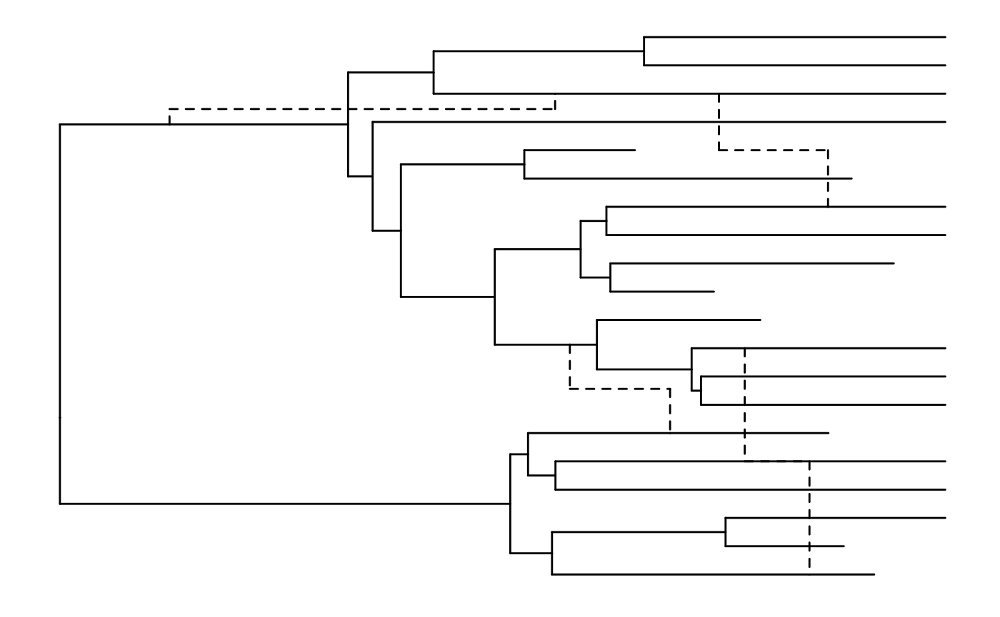

---
# (This front matter is required by JOSS)
# (See here for formatting & submission guidelines: https://joss.readthedocs.io/en/latest/submitting.html#how-should-my-paper-be-formatted)
title: "`ggret`: An R package for visualizing and manipulating tree‑based phylogenetic networks"

tags:
  - R
  - phylogenetic network
  - ancestral recombination graph
  - arg
  - phylogenetics
  - reticulated evolution
  - visualisation
  - plotting

authors:
  - name: Gerd Specht
    affiliation: "1,2"
    corresponding: true
  - name: Clemens Schmid
    orcid: 0000-0003-3448-571
    affiliation: 3
  - name: Denise Kühnert
    orcid: 0000-0002-5657-018X
    affiliation: "2,4"
  - name: Arthur Kocher
    orcid: 0000-0002-9499-6472
    affiliation: "2,3"
    corresponding: true


affiliations:
 
 - name: Faculty of Mathematics and Computer Science, Friedrich Schiller University Jena, Germany
   index: 1
 - name: Transmission, Infection, Diversification & Evolution Group, Max Planck Institute of Geoanthropology, Jena, Germany
   index: 2
 - name: Department of Archaeogenetics, Max Planck Institute for Evolutionary Anthropology, Leipzig, Germany
   index: 3
 - name: Centre for Artificial Intelligence in Public Health Research, Robert Koch Institute, Wildau, Germany
   index: 4

date: 1 March 2024
bibliography: paper.bib
---

```{=html}
<!---
- 250-1000 words

- A summary describing the high-level functionality and purpose of the software for a diverse, non-specialist audience.

- A Statement of need section that clearly illustrates the research purpose of the software and places it in the context of related work.

- A list of key references, including to other software addressing related needs. Note that the references should include full names of venues, e.g., journals and conferences, not abbreviations only understood in the context of a specific discipline.

- Mention (if applicable) a representative set of past or ongoing research projects using the software and recent scholarly publications enabled by it.

- Acknowledgement of any financial support.
-->
```
# Summary

The evolutionary relationships of biological entities are most often represented with phylogenetic trees. Phylogenetic trees consist of branches (or edges) representing direct lines of descents or genetic flow from ancestor to offspring (i.e. lineages), and nodes representing evolutionary "splits" through which a parental lineage gives rise to multiple child lineages. This vertical model of evolution has provided immense insights into the evolutionary history and processes underlying observed biological diversity. However, it fails to account for "horizontal" modes of evolution, whereby genetic material can be exchanged between contemporaneous organisms through a variety of mechanism across the tree of life [@arnold2022horizontal; @keeling2024horizontal; @perez2015recombination]. In recent years, advances in sequencing technologies and computational methods have made it increasingly possible to integrate horizontal evolutionary events into reticulated phylogenetic trees (or phylogenetic networks; @huson_application_2006). While phylogenetic networks have the potential to provide more comprehensive and accurate evolutionary pictures for many biological groups, the development of specific tools is required for their manipulation and visualization.

# Statement of need

`ggret` is an R package for the visualisation of tree-based phylogenetic networks (i.e. phylogenetic trees with additional horizontal edges). The R language is commonly used for phylogenetic analysis and visualisation with packages such as `ape` and `ggtree` providing important functionalities for phylogenetic research [@paradis_ape_2019; @yu_ggtree_2017]. `ggret` builds up on these functionalities by extending `ggtree` with methods for handling tree-based phylogenetic networks while maintaining compatibility between the packages.

# Usage

`ggret` is available on [GitHub](https://github.com/grdspcht/ggret) and can be installed by using `devtools'` `install_github` function.

``` r
# Install from GitHub
install.packages('devtools') # this may take a minute
library(devtools)
install_github('grdspcht/ggret')
library(ggret)
```

`ggret` provides functions for reading extended Newick and (*BEAST2*) NEXUS format [@cardona_extended_2008]. This allows the user to visualise phylogenetic networks inferred from various programs. Here we parsed a (summary) phylogenetic network simulated with the *BEAST2* package *Bacter* [@vaughan2017inferring] containing various node metadata, using the `read.beast.retnet` function. Note that the resulting retnet `treedata` object has been directly included in the package for the sake of reproducibility.

``` r
retnet <- read.beast.retnet("../data/retnet.nexus")
```

`ggret` is the central function of this package. In a simple call without additional arguments it only plots rudimentary tree-based network without any labelling. Reticulated edges are drawn as black dashed lines by default, but `ggret` contains various argument to change their aspects\autoref{fig:arg1}.

``` r
#simple network
p1 <-ggret(retnet)
#reticulation edges displayed as red dotted lines, in a "snake" shape
p2 <- ggret(retnet,retcol = "red",retlinetype = 3)
#reticulation edges displayed as blue solid lines, in a straight shape and with arrow heads
p3 <- ggret(retnet,retcol = "blue",retlinetype = 1,arrows = T,rettype ="straight")
#plot
ggpubr::ggarrange(p1,p2,p3,nrow=1)
```

{width="66%"}

We can rotate some of the nodes to avoid crossing of reticulation edges and improve visualization using the `ggtree` `rotate` function. Note that one can initially visualize node indices using `ggret(retnet) + geom_nodelab(aes(label=node))` to make this easier\autoref{fig:arg2}.

``` r
#rotate nodes to improve vizualisation
rotate(p1,node=31) %>%
  rotate(node=30) %>%
  rotate(node=26) %>%
  rotate(node=37) ->
  p1
#plot
p1
```

{width="66%"}

Annotations can easily be added using `ggtree` functions, such as `geom_tiplab`, `geom_nodelab` and `geom_range`. In addition, a time axis can easily be added as using the `theme_tree2` theme\autoref{fig:arg3}.

``` r
#get the tMRCA of the tree and define time points to display in the time axis in years BP
tmrca <- phytools::nodeHeights(retnet@phylo) %>% max
xticks_BP=c(20000,15000,10000,5000,0)

#add tip and node labels (we expand the x axis limits so that tip labels still fit in
p1 <- p1 +
  geom_tiplab() +
  geom_nodelab(aes(label=round(posterior,2)),vjust=-0.25,hjust=1.3,size=3) +
  expand_limits(x=22000)

#adding a time axis and node bars indicating node heights' 95% highest posterior density interval
p1 <- p1 +
  theme_tree2() +
  geom_range(aes(range="height_95_HPD"), color="grey50", alpha=.6, size=1.5) +
  scale_x_continuous(breaks = tmrca - xticks_BP, labels=xticks_BP) +
  xlab("Years before present")

#plot 
plot(p1)
```

{width="66%"}

The `groupClade` can be used to define clades within a network and color them accordingly. `groupClade` assigns clade information to all nodes descending from the MRCA of tips specified in the `nodes` argument\autoref{fig:arg4}.

``` r
#define clades using the groupClade function
retnet %>%
  groupClade(nodes = c("taxon_10", "taxon_20"), cladename = "A",addtotreedata = T) %>%
  groupClade(nodes = c("taxon_11", "taxon_15"), cladename = "B",addtotreedata = T) %>%
  groupClade(nodes = c("taxon_1", "taxon_16"), cladename = "C",addtotreedata = T) ->
  retnet_clade

#plot network with colored clades
p_colored <- ggret(retnet_clade, aes(color=clade))
plot(p_colored)
```

{width="66%"}

For additional information, refer to `ggret's` internal documentation or to [github.com/grdspcht/ggret](https://github.com/grdspcht/ggret) which also gives users the opportunity to open issues, pull requests or make bug reports.

```{=html}
<!---
# Citations

Citations to entries in paper.bib should be in
[rMarkdown](http://rmarkdown.rstudio.com/authoring_bibliographies_and_citations.html)
format.

If you want to cite a software repository URL (e.g. something on GitHub without a preferred
citation) then you can do it with the example BibTeX entry below for @fidgit.

For a quick reference, the following citation commands can be used:
- `@author:2001`  ->  "Author et al. (2001)"
- `[@author:2001]` -> "(Author et al., 2001)"
- `[@author1:2001; @author2:2001]` -> "(Author1 et al., 2001; Author2 et al., 2002)"

-->
```
```{=html}
<!---
# Figures

Figures can be included like this:

and referenced from text using \autoref{fig:example}.

Figure sizes can be customized by adding an optional second parameter:
{ width=20% }
-->
```
# Acknowledgements

# References

<!--- Auto-generated, no need to add something here -->
