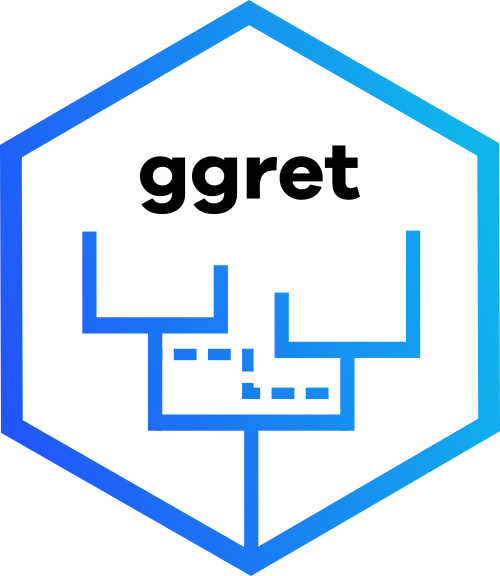

```{r, include = FALSE}
knitr::opts_chunk$set(
  collapse = TRUE,
  comment = "#>"
)
```

```{r setup, include=FALSE}
library(ggret)
#library(ggpubr)
```

<style>
    pre {
        border: 0;
    }
</style>



`ggret` is an R package for the visualization of tree-based phylogenetic networks.  Its builds on and extends `ggplot2` and `ggtree` and aims to be compatible with these packages. For more details about `ggtree`'s functionalities, please see the `ggtree` vignette here: <https://yulab-smu.top/treedata-book/>

## Installation

As a first step, we recommend getting `ggplot2` from CRAN and `ggtree` from Bioconductor if you haven't done this previously. The `ggret` package is available via GitHub and can be installed with the `remotes` package.

```{r message = FALSE, warnings = FALSE, eval=FALSE}
# Install ggplot2
install.packages("ggplot2")

# Install ggtree
if (!require("BiocManager", quietly = TRUE))
    install.packages("BiocManager")

BiocManager::install("ggtree")

# Install ggret
if (!requireNamespace("remotes", quietly=TRUE))
  install.packages("remotes")
remotes::install_github("grdspcht/ggret", dependencies = TRUE, build_vignettes = TRUE))
```

## Parsing network formats

`ggret` provides parsing functions building upon `ape::read.tree` and `treeio::read.beast` for reading extended Newick and BEAST2 NEXUS files with network blocks. The input data is stored in `evonet` or `treedata` objects and can be used for plotting and further analysis.

```{r, message = FALSE, eval=FALSE}
library(ggret)

# read_enewick parses extended Newick format and generates an evonet object. 
nw <- ggret::read_enewick("../data/retnet.nwk")

# read_beast_retnet parses BEAST2 NEXUS files and generates a treedata object.
nw_beast <- ggret::read_beast_retnet("../data/retnet.nexus")
```

For the next step of the tutorial, we will instead use the `retnet` object that comes with this package. It is a `treedata` object corresponding to a (summary) phylogenetic network simulated with the BEAST2 package [Bacter](https://github.com/tgvaughan/bacter) containing various node metadata.

## Plotting a basic phylogenetic network

`ggret` is the central function of this package. In a simple call without additional arguments it only plots a visual representation of the phylogenetic network.

We first use the original `ggtree` function to plot the backbone tree of the `retnet` object

```{r message = TRUE, warnings = FALSE, fig.dim = c(5, 3)}
ggtree::ggtree(retnet)
```

We now plot the entire network, including reticulation edges, using the `ggret` function.

```{r message = TRUE, warnings = FALSE, fig.dim = c(5, 3)}
ggret::ggret(retnet)
```

## Changing the aspect of reticulation edges

The `ggret` functions can take different arguments to change the aspect of reticulation edges.

```{r  message = TRUE, warnings = FALSE, fig.dim = c(5, 3)}
# Reticulation edges displayed as red dotted lines, in a "snake" shape
p1 <- ggret::ggret(retnet,retcol = "red",retlinetype = 3)
# Reticulation edges displayed as blue solid lines, in a straight shape and with arrow heads
p2 <- ggret::ggret(retnet,retcol = "blue",retlinetype = 1, arrows = T, rettype ="straight")
# Plot
plot(p1)
plot(p2)
```

<!-- ## Rotating nodes to improve visualization

We can rotate some of the nodes to avoid crossing of reticulation edges and improve visualization using the `ggtree` `rotate` function. Note that one can initially visualize node indices using `ggret(retnet) + geom_nodelab(aes(label=node))` to make this easier.

```{r message = TRUE, warnings = FALSE, fig.dim = c(5, 3), error=FALSE}
library(ape)
#create initial plot
#p <- ggret::ggret(retnet)
#rotate nodes to facilitate visualization
#ape::rotate(p,node=31) %>%
#  ape::rotate(node=30) %>%
#  ape::rotate(node=26) %>%
#  ape::rotate(node=37) ->
#  p
#plot
#p
```

-->

## Annotating a phylogenetic network

Adding `geom_tiplab` and `geom_nodelab` from `ggtree` to our previous call allows us to annotate the network with metadata that is stored in the `retnet` object.

Here is an example to add tip labels and posterior support values at the nodes. Note that we have to expand the x axis limits to make the tip labels visible.

```{r message = TRUE, warnings = FALSE, fig.dim = c(5, 3)}
ggret::ggret(retnet) + 
  ggtree::geom_tiplab() +
  ggtree::geom_nodelab(aes(label=round(posterior,2)),vjust=-0.25,hjust=1.2,size=3) +
  ggplot2::expand_limits(x=23000)
```

Here is another example in which we add a time axis to the plot, as well as the node heights' 95% highest posterior density intervals represented by bars. This example requires the `phytools` package. 

```{r  message = TRUE, warnings = FALSE, fig.dim = c(5, 3)}
# Get the tMRCA of the tree and define time points to display in the time axis in years BP
library(phytools)
tmrca <- phytools::nodeHeights(retnet@phylo) %>% max
xticks_BP=c(20000,15000,10000,5000,0)

# Plot the network
ggret::ggret(retnet) +
  ggtree::theme_tree2() +
  ggtree::geom_range(aes(range="height_95_HPD"), color="grey50", alpha=.6, size=1.5) +
  ggplot2::scale_x_continuous(breaks = tmrca - xticks_BP, labels=xticks_BP) +
  ggplot2::xlab("Years before present")
```

## Adding color to your network

With `group_clade` we can define clades within our network and then use `aes` to color them accordingly. `group_clade` assigns clade information to all nodes descending from the MRCA of tips specified in the `nodes` argument. The value taken is specified in the `cladename` argument and is added as a `clade` attribute in the evonet object and, in addition, as a `Clade` column in the data component of tree data objects if the `addtotreedata` argument is set to true. 

```{r message = TRUE, warnings = FALSE, fig.dim = c(5, 3)}
# Define clades using the group_clade function
retnet %>%
  ggret::group_clade(nodes = c("taxon_10", "taxon_20"), cladename = "A",addtotreedata = T) %>%
  ggret::group_clade(nodes = c("taxon_11", "taxon_15"), cladename = "B",addtotreedata = T) %>%
  ggret::group_clade(nodes = c("taxon_1", "taxon_16"), cladename = "C",addtotreedata = T) ->
  retnet_clade

# Plot network with colored clades
ggret::ggret(retnet_clade, aes(color=Clade))
```

## Citations

If you use `ggret`, please cite the associated publication as well as the original `ggtree` publication:

1. ggret publication to be added
2. __G Yu__, DK Smith, H Zhu, Y Guan, TTY Lam^\*^. ggtree: an R package for
visualization and annotation of phylogenetic trees with their covariates and
other associated data. __*Methods in Ecology and Evolution*__. 2017, 8(1):28-36.
doi: [10.1111/2041-210X.12628](https://doi.org/10.1111/2041-210X.12628).


## Further Reading

Don't forget to check ggret's documentation for further info on functions.\\

For further information on expanding your plots, please refer to the extensive [ggtree manual](https://yulab-smu.top/treedata-book/index.html) or the [ggplot2 documentation.](https://ggplot2.tidyverse.org/reference/)  
